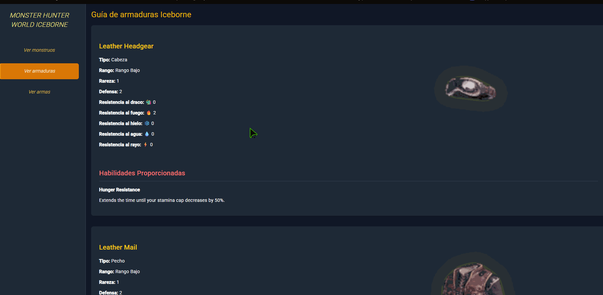
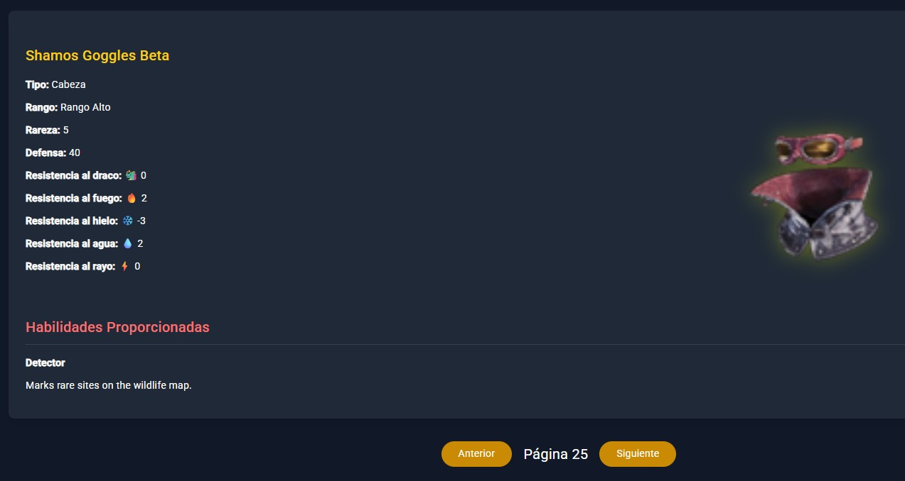
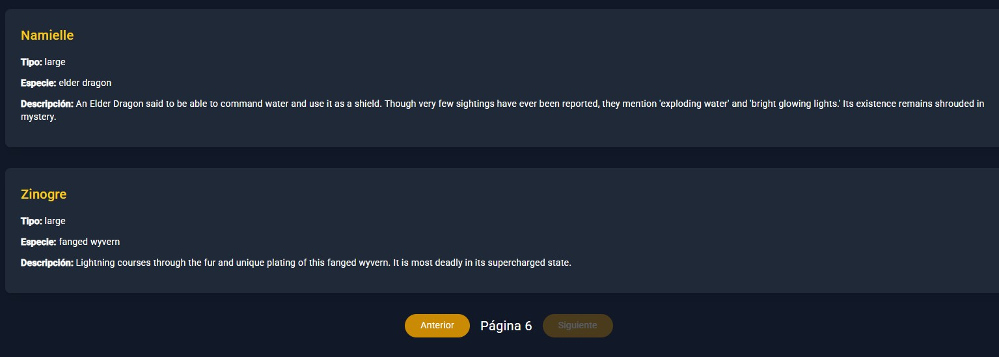
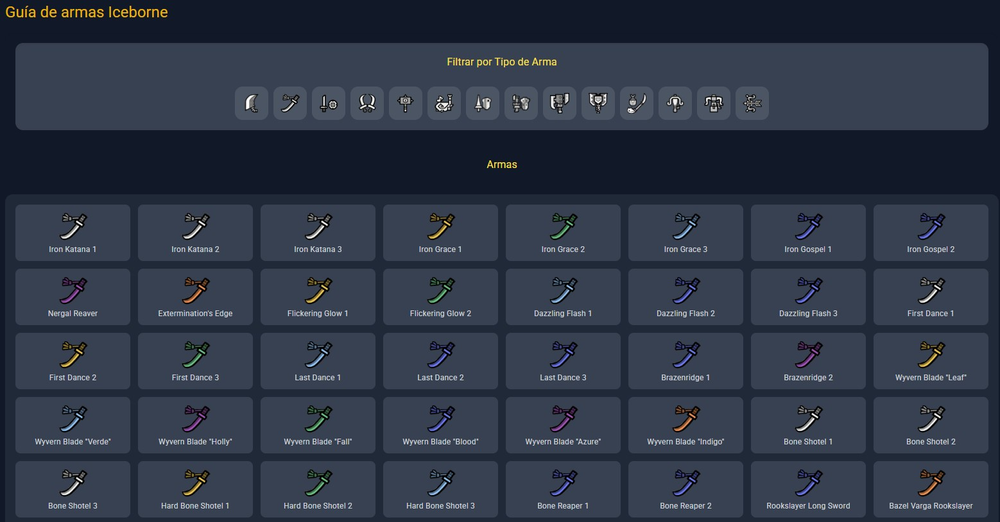

# 🟨 Monster Hunter App

SPA desarrollada en Angular que permite explorar el universo de Monster Hunter mediante consumo de API REST, con visualización interactiva de monstruos, armaduras y armas.
---

## 🚀 Qué puedes hacer en la app
🐲 Explorar monstruos con información detallada
🛡️ Consultar armaduras con estadísticas y habilidades
⚔️ Filtrar armas por tipo con visualización dinámica
🧭 Navegar entre secciones protegidas con confirmación
🖼️ Interfaz dinámica basada en datos reales de API

🎬 Demo

---

## ⚙️ Funcionalidades

- Consumo de API REST externa para obtención de datos
- Visualización dinámica de información en la interfaz
- Navegación entre vistas mediante Angular Router
- Protección de rutas mediante Guards
- Interceptores HTTP para gestión centralizada de peticiones
- Uso de servicios para la lógica de negocio y comunicación con la API
- Definición de interfaces TypeScript para tipado de datos
- Manejo de estados de carga en peticiones asíncronas
- Arquitectura basada en componentes reutilizables

📸 Capturas

Equipamiento:

Monstruos:

Armas:

---

## 🧱 Arquitectura del proyecto

El proyecto sigue una arquitectura estructurada en capas:

- **Componentes** → capa de presentación reutilizable y desacoplada
- **Servicios** → gestión de llamadas HTTP y lógica de datos
- **Guards** → protección de rutas y control de acceso
- **Interceptors** → manejo global de peticiones HTTP
- **Interfaces** → tipado de datos para asegurar consistencia
- **Routing** → navegación entre vistas de la aplicación

---

## 🛠️ Tecnologías utilizadas

- Angular
- TypeScript
- JavaScript (ES6+)
- HTML5
- CSS3 / SASS
- RxJS
- Angular Router
- HttpClient
- Angular Guards
- HTTP Interceptors

---

## 🎯 Objetivo del proyecto

Este proyecto tiene como objetivo reforzar conocimientos en Angular aplicando patrones de desarrollo modernos, especialmente en:

- Consumo de APIs REST
- Arquitectura modular en Angular
- Uso de Guards para protección de rutas
- Uso de Interceptors para control de peticiones HTTP
- Tipado fuerte con TypeScript mediante interfaces
- Separación de responsabilidades (componentes, servicios, lógica)

---

## 🚀 Posibles mejoras futuras

- Implementación de filtros avanzados de búsqueda
- Paginación de resultados
- Mejora de diseño responsive
- Gestión de estado global (NgRx o Signals)
- Caché de peticiones HTTP para optimización de rendimiento

---

## 👨‍💻 Autor

Álvaro Martínez Sagristá  
Frontend Developer (Angular)

---

## 📌 Nota

Proyecto desarrollado con fines educativos y de práctica en desarrollo frontend con Angular y consumo de APIs REST.
